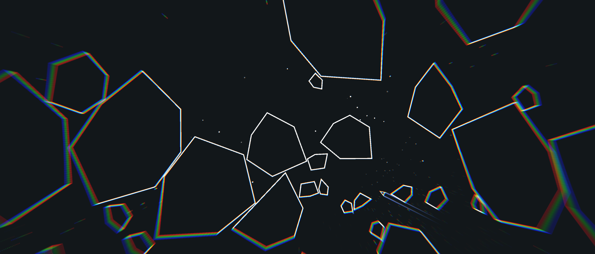

<h1>

AstralElites
</h1>

Modern take on the game _'Asteroids'_ made in **Unity**.

  
  <i>Gameplay video from 'Astral Elites - The best Asteroids clone?'</i>

## 🔍 Overview

Astral Elites began as an _'Asteroids'_ clone for an interview code test.

## ✨ Features

### Discord Integration

This project utilises the Discord SDK in-order to implement Rich Presense.
